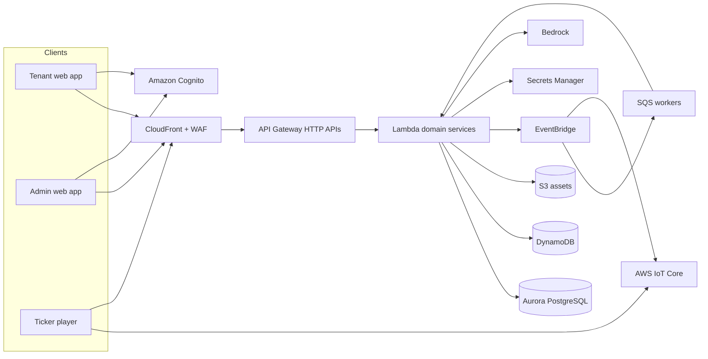
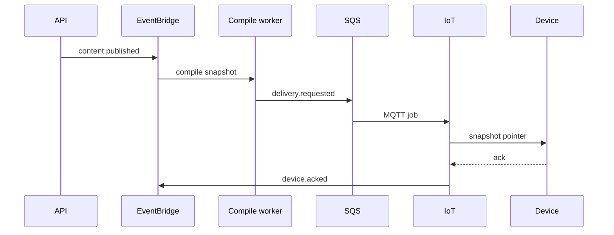
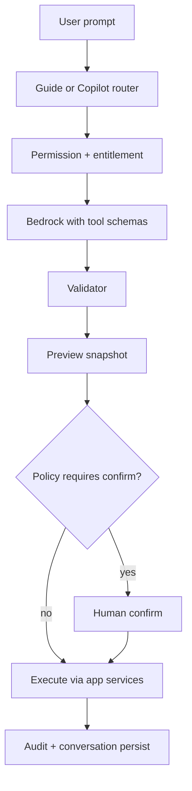
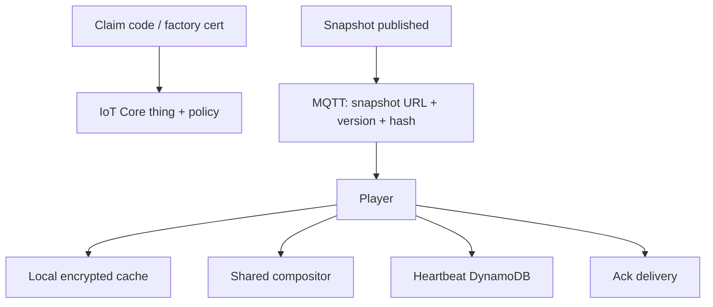

# Phase 3 — Target-State Architecture

Serverless-first, multi-tenant Ticker CMS on AWS. One product platform, two web apps, one player runtime.

## 1. High-level architecture



Principles:

- **API Gateway → Lambda → managed data** for synchronous work.
- **EventBridge** for domain events; **SQS** for retries; **Scheduler** for campaign wakeups.
- **Cognito** for authentication; **our DB** for authorization and entitlements.
- **IoT Core** for device command/heartbeat; **S3/CloudFront** for snapshot assets.
- **No always-on app servers** in the target state.

## 2. AWS architecture (selected services)

| Service | Use |
| --- | --- |
| CloudFront | SPA, CDN for public/platform catalog, optional signed media |
| WAF | Rate, bot, geo/IP as needed |
| S3 | SPA hosting, assets, snapshots, audit payloads |
| API Gateway (HTTP API) | Versioned `/v1` APIs, JWT authorizer |
| Lambda | Domain handlers + workers |
| Cognito | User pools: `tenant` and `platform` |
| Aurora PostgreSQL Serverless v2 | System of record |
| DynamoDB | Heartbeats, delivery cursors, idempotency, rate counters |
| EventBridge | Domain bus + Scheduler |
| SQS / DLQ | Publish, email, media processing |
| Step Functions | Multi-step publish compile (optional from M3; start as Lambda if simple) |
| Secrets Manager + KMS | Stripe, market data, JWT extras |
| CloudWatch + X-Ray | Metrics, logs, traces |
| CloudTrail | Account audit |
| IAM | Least privilege per function |
| AWS IoT Core | MQTT, device certs, shadows optional |
| Bedrock | Tool-calling models |
| SES | Email |
| CDK | Infrastructure as code (TypeScript) |

**Not selected initially:** OpenSearch (Postgres search + later if needed), ECS/EKS, NAT-heavy VPC for every Lambda (use VPC only for Aurora).

**Billing:** Stripe (see ADR 013). Webhooks → API Gateway → Lambda (signature verify, idempotency).

## 3. Frontend architecture

- `apps/web` — tenant portal (Vite, React, TypeScript)
- `apps/admin` — platform admin
- `apps/player` — compositor host for devices and preview iframe
- `packages/ui` — design system
- `packages/composition` — document types, validator, compositor (canvas)
- `packages/api-client` — typed SDK from OpenAPI
- `packages/entitlements` — shared entitlement key constants (no business rules)

State: TanStack Query for server state; a small editor store only for undo stack and selection.

Routing by product area: dashboard, tickers, content, editor, templates, animations, campaigns, assets, analytics, billing, users, settings, AI.

## 4. Backend architecture

**Modular monolith** in a Lambda-friendly Node.js (TypeScript) or split by domain later without changing APIs.

Suggested packages:

- `services/api` — HTTP composition, auth middleware, OpenAPI
- `services/workers` — EventBridge/SQS consumers
- `packages/domain-*` — billing, fleet, authoring, scheduling, publishing, ai, audit

Each use-case:

1. Authenticate JWT  
2. Resolve membership + permissions  
3. Resolve **effective entitlements**  
4. Load aggregate with `organization_id`  
5. Validate  
6. Persist  
7. Emit event  
8. Audit  

No SQL from the UI. No entitlement `if` in React for security (UI may hide; API must deny).

API style: REST, resource-oriented, `/v1/{domain}/...`, idempotency keys on publishes and billing mutations.

### Domain API surfaces (v1)

| Domain | Example resources |
| --- | --- |
| Identity session | `/v1/me`, `/v1/me/sessions`, `/v1/orgs/{id}/switch` |
| Organizations | `/v1/organizations` |
| Users / roles | `/v1/memberships`, `/v1/roles` |
| Entitlements | `/v1/entitlements/me` |
| Billing | `/v1/billing/subscription`, `/v1/billing/invoices`, `/v1/billing/portal` |
| Tickers / devices | `/v1/tickers`, `/v1/devices`, `/v1/device-groups` |
| Content | `/v1/contents`, `/v1/contents/{id}/versions`, `/v1/contents/{id}/publish` |
| Templates | `/v1/templates` |
| Animations | `/v1/animation-packs` |
| Campaigns / schedules | `/v1/campaigns`, `/v1/playlists` |
| Assets | `/v1/assets/uploads` |
| Publishing | `/v1/publishing-jobs`, `/v1/deliveries` |
| Analytics | `/v1/analytics/overview` |
| AI | `/v1/ai/conversations`, `/v1/ai/tool-calls/{id}/confirm` |
| Notifications | `/v1/notifications` |
| Audit | `/v1/audit-logs` (permissioned) |
| Admin | `/v1/admin/...` (platform pool only) |

Errors: problem+json; codes such as `subscription_inactive`, `entitlement_exceeded`, `forbidden`, `conflict`.

## 5. Data architecture

See ADR 003.

- **PostgreSQL**: tenants, RBAC, billing projections, content metadata, schedules, campaigns, audit index
- **DynamoDB**: `DeviceHeartbeat`, `DeviceDeliveryCursor`, `Idempotency`
- **S3**: binaries + compiled snapshots `s3://.../org/{id}/snapshots/{snapshotId}/`
- **IoT Device Shadow** (optional): desired snapshot version vs reported

Access patterns that drove this split:

- High-frequency heartbeats must not land in Aurora.
- Relational reporting, subscriptions, and RBAC benefit from SQL.
- Large media never in the database.

## 6. Event architecture



Example events (past tense, versioned):

- `organization.suspended`
- `subscription.updated`
- `entitlements.recomputed`
- `content.published`
- `campaign.activated` / `campaign.deactivated`
- `device.offline.detected`
- `ai.tool.executed`

Consumers are independently deployable Lambdas.

Scheduler: EventBridge Scheduler for campaign windows and grace expiry (or a periodic reconciler as backup).

## 7. AI architecture



- Models via Bedrock (Converse API / tool use).
- Tools wrap **application services**, not repositories.
- Prompt context: current route, role, plan feature flags, **only** resources the user can read.
- Prompt injection: treat tool args as untrusted; re-validate server-side.
- No browsing the production database for “whatever the model wants”.

Guide chatbot tools are limited to: search help corpus, propose in-app routes, optionally `navigate` client-side. It must not expose other tenants, billing internals, or unpublished content the user cannot read.

## 8. Device communication architecture



- HTTPS for large downloads (CloudFront).
- MQTT for commands: `set_snapshot`, `reboot` (capability), `config`.
- Offline: play last snapshot; queue heartbeats; on reconnect fetch if version differs.
- Do not require devices to poll the full CMS API with user JWTs.

Player should embed **the same compositor package** compiled for the device runtime (web-based player first: WebView or Chromium kiosk; native later).

## 9. Authentication architecture

- Cognito User Pool **tenant**: SRP, MFA optional/required by policy, hosted or custom UI.
- Cognito User Pool **platform**: MFA required.
- API Gateway JWT authorizer → Lambda loads `Membership` + permissions (cache in memory short TTL; invalidate on role change events).
- Device auth: X.509 IoT certificates, not user passwords.
- Service-to-service: IAM for Lambda; no long-lived static keys in code.

Suspicious login: Cognito advanced security (or equivalent risk signals) + lockout + notification. Session list stored as refresh-token metadata we can revoke.

## 10. Subscription architecture

Stripe is the **charge** ledger. Aurora `Subscription` + `Entitlement` is the **access** ledger.

Webhook: `checkout.session.completed`, `customer.subscription.*`, `invoice.*` → verify → idempotency table → update subscription → `entitlements.recomputed` → optionally revoke publishes for expired orgs (stop new snapshots; devices may keep last legal snapshot per policy).

**Enforcement points:**

- API middleware `requireEntitlement(key, cost?)`
- Publish worker
- Asset upload (storage quota)
- AI orchestrator
- Device pairing (device count)

Frontend uses `GET /v1/entitlements/me` for UX only.

Restricted mode: Cognito still authenticates; API returns `402`/`403` with `code: subscription_inactive` except billing and read-limited routes.

## 11. Media architecture

Upload: presigned POST → S3 `uploads/` → EventBridge → validate MIME/size → optional malware scan → transcode/normalize Lottie JSON → move to `assets/` → DB row `ready`.

Delivery: CloudFront. Tenant private assets: signed cookies or short-lived signed URLs. Platform packs: public cacheable.

Never serve unvalidated JSON as Lottie to devices.

## 12. Security architecture

- TLS everywhere; HSTS on CloudFront.
- KMS CMKs for Secrets, S3 SSE-KMS for sensitive buckets.
- WAF on public APIs.
- CSP on SPAs; no `eval` in compositor.
- Tenant isolation tests in CI.
- File type allowlists; image dimension limits; video (later) scanned.
- AI: output cannot include other orgs; tools re-check authz.
- Device secrets never in the web app.
- CSRF: SPA + JWT in Authorization header (not cookies) or SameSite cookies if cookie session is later chosen; default **Bearer JWT**.
- Input validation with Zod/JSON Schema at the edge of every handler.

## 13. Observability architecture

- Structured JSON logs: `requestId`, `organizationId`, `userId`, `deviceId`.
- Metrics: API latency, 4xx/5xx, Lambda errors, SQS depth, DLQ, webhook failures, IoT connect count, publish success rate, AI throttle.
- Alarms: DLQ > 0, webhook fail rate, auth lockouts spike, Aurora ACU, cost anomaly.
- Dashboards: ops (AWS), product (app analytics tables — later).

## 14. Repository architecture (GitHub)

Monorepo (ADR 001):

```
/apps/web
/apps/admin
/apps/player
/packages/*
/services/api
/services/workers
/infrastructure
/docs
/tests/e2e
/scripts
```

Branching: `main` protected; trunk-based with short-lived PRs.

Environments: `dev`, `staging`, `prod` — separate AWS accounts preferred.

## 15. CI/CD strategy

GitHub Actions:

1. Lint, typecheck, unit tests  
2. OpenAPI diff (breaking change warn)  
3. CDK synth / OIDC deploy to dev on main  
4. Staging on tag or merge  
5. Prod via approved workflow  

Security: `pnpm audit`, secret scanning, SAST (e.g. CodeQL), IaC (cdk-nag).

No prod credentials in GitHub secrets beyond OIDC role.

## 16. Testing strategy

| Layer | Focus |
| --- | --- |
| Unit | Entitlement evaluation, schedule conflict, compositor pixel snap, validators |
| Integration | API + Aurora (testcontainers), webhook idempotency |
| E2E | Onboard, draft/publish, restricted mode |
| Security | Cross-tenant IDOR suites |
| Subscription | Expired, past_due, grace, cancel, admin override |
| Device | Offline play, ack, retry |
| AI | Unauthorized tool, invalid args, confirmation gate |

## 17. Cost considerations (directional)

Drivers: CloudFront bytes, IoT messages, Lambda duration, Aurora minimum ACUs, Bedrock tokens, S3.

Controls:

- Heartbeats aggregated (e.g. 30–60s), DynamoDB on-demand.
- Snapshots are pointers; don’t push full Lottie on every MQTT message.
- Bedrock max tokens per request + monthly entitlement.
- Aurora scales to zero only if acceptable cold start; likely **min ACU 0.5** always on in prod.
- Separate access logs lifecycle.

Exact budget TBD with usage assumptions.

## 18. Risks

| Risk | Mitigation |
| --- | --- |
| Player/firmware cannot run compositor | Ship WebView player; adapter layer; hardware spike in M2 |
| Preview ≠ hardware | Shared package + device golden tests with screenshots |
| Subscription loopholes | Central entitlement service + contract tests |
| MQTT at scale cost | Pointer messages; batch; QoS choices |
| AI unsafe publishes | Confirm + dry-run + audit |
| Market data licensing | Entitlement + connector isolation |
| Serverless cold starts on editor APIs | Provisioned concurrency only if measured |
| Single-region outage | Backup/PITR; later multi-region |

## 19. Open questions

Documented in [implementation-plan.md](./implementation-plan.md) § Open questions. Architecture does not invent SLAs or prices.
