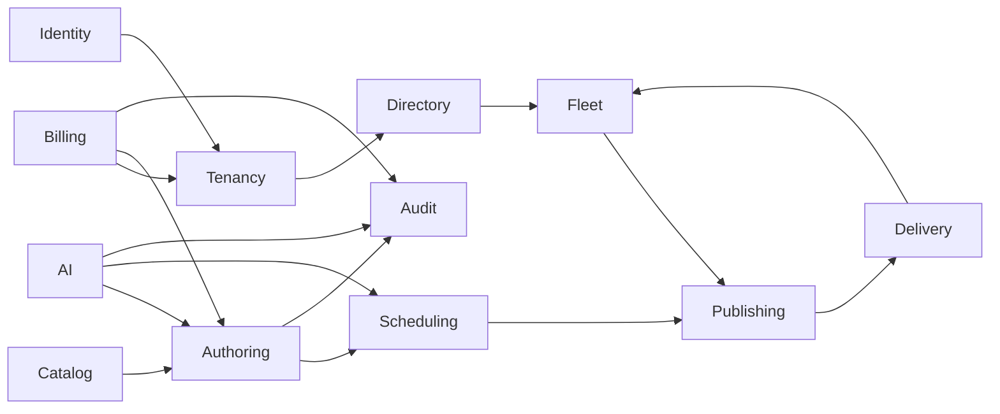
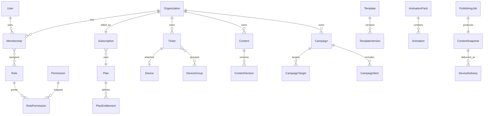

# Phase 2 — Domain Model

Bounded contexts: **Identity**, **Tenancy**, **Billing**, **Directory**, **Catalog** (templates/animations), **Authoring**, **Scheduling**, **Fleet**, **Publishing**, **Delivery**, **AI**, **Audit**, **Notifications**.

MVP is **one deployable backend** (modular monolith / domain packages) — not a mesh of microservices.

## 1. Context map



## 2. Core entities

### Organization (tenant)

- `id`, `slug`, `name`, `status` (`active` | `suspended` | `closed`)
- `timezone`, `locale`, `branding` (later)
- `subscription_id` (current)
- Soft-delete only via `closed`

### User / Membership

- **User**: global identity (Cognito `sub`, email, MFA flags)
- **Membership**: `user_id` + `organization_id` + `role_ids` + `status`
- A user may belong to multiple orgs (switcher)

### Role / Permission

- `Permission`: stable key e.g. `content.publish`
- `Role`: name, `scope` (`platform` | `tenant`), `is_system`
- `RolePermission`: mapping
- Custom tenant roles allowed; system roles seeded

Seeded tenant roles (data, not hard-coded authorization): Organization Owner, Organization Admin, Content Manager, Designer, Operator, Viewer.

Seeded platform roles: Super Admin, Platform Admin, Support Admin, Billing Admin, Content Admin.

### Plan / Entitlement / Subscription

- `Plan`: marketing name, public, sort order
- `PlanEntitlement`: `key`, `limit` (int or JSON), `enabled`
- `Subscription`: org, plan, provider ids, `status`, period start/end, trial end, cancel_at
- `SubscriptionItem`: optional add-ons (extra devices, animation packs)
- `EntitlementOverride`: admin or promotional, expiry, reason
- `Invoice`, `Payment`, `PaymentAttempt`, `UsageRecord` (AI tokens, storage)
- `SubscriptionEvent`: webhook/audit of billing state machine

**Effective entitlements** = plan ∪ subscription items ∪ overrides, evaluated by Entitlement Service.

Example entitlement keys (extensible):

- `users.max`, `devices.max`, `storage.bytes`
- `templates.org.max`, `ai.tokens.monthly`, `ai.copilot`
- `packs.festivals`, `packs.alerts`, `data.market`, `scheduling.advanced`
- `analytics.advanced`, `api.public`, `content.publish`

### Ticker / Device / DeviceGroup

- `Ticker`: org-facing display name, location, tags, current `device_id`
- `Device`: `serial`/`claim_code`, `iot_thing`, matrix `width`/`height`, orientation, firmware, last_heartbeat, capabilities JSON
- `DeviceGroup`: org, members
- `DeviceReplacement`: old → new, timestamp

### Asset

- org (null = platform), kind (`image` | `video` | `lottie` | `font` | `svg`), s3 key, hash, bytes, virus-scan status, metadata (intrinsic w/h/fps)

### Content / ContentVersion

- `Content`: org, title, type discriminator, `head_draft_version_id`, `published_version_id`, status
- `ContentVersion`: immutable document JSON, schema version, created_by, parent_version_id

### Template / TemplateVersion

- Same versioning pattern; `visibility` (`platform` | `organization`)
- `category`, `preview_asset_id`

### Animation / AnimationPack

- `AnimationPack`: slug, category (festivals, alerts, …), entitlement key, version
- `Animation`: pack, name, lottie/asset refs, tags, recommended matrix hints

Suggested pack categories (catalog data): Business, News, Promotions, Festivals, Seasonal, Holidays, Sports, Alerts, Events, Corporate, Retail.

### Campaign / Schedule / Playlist

- `Campaign`: org, name, priority, status, start/end datetime, recurrence RRULE or structured recurrence, timezone
- `CampaignTarget`: ticker_id or group_id
- `CampaignItem`: content_id or template_id + data bindings
- `Playlist`: ordered items for a ticker when no higher campaign applies (“default”)
- `ScheduleWindow`: materialized or evaluated at publish time

Priority is an integer. Default seed: Emergency 1000, Campaign 100, Promo 50, Default 0 — **seed data, not code**.

### PublishingJob / DeviceDelivery

- `PublishingJob`: snapshot_id, trigger (`manual` | `schedule` | `ai` | `system`), status
- `ContentSnapshot`: immutable bundle (document, asset URIs + hashes, compiled timeline)
- `DeviceDelivery`: device_id, snapshot_version, status (`pending` | `sent` | `acked` | `failed` | `stale`), attempts

### AI

- `AIConversation`: org, user, channel (`copilot` | `guide`)
- `AIMessage`
- `AIToolCall`: tool name, args JSON, validation result, confirmation, execution result, `content_id` affected

### AuditLog / Notification

- `AuditLog`: append-only; org nullable for platform; actor; action; resource type/id; prev/new JSON (or hashes + S3 for large docs); ip; user_agent; `source`
- `Notification`: user/org, type, payload, read_at
- Outbound email via provider; store metadata, not full HTML bodies as SoR

## 3. Lifecycle states

### Subscription.status

```
incomplete → trialing → active ⇄ past_due → grace → expired
active → cancelled (access until current_period_end)
any → suspended (admin)
```

Transitions only via Billing + Entitlement services.

### Content.status

`draft` | `published` | `archived`

Versions are never overwritten.

### Device.lifecycle

`pending_pair` → `active` → `deactivated`  
`active` → `replaced`

### PublishingJob.status

`queued` → `compiling` → `dispatching` → `completed` | `partial` | `failed`

### Campaign.status

`draft` | `scheduled` | `running` | `ended` | `paused` | `cancelled`

## 4. Relationship sketch



## 5. Identity of records

- Public IDs: ULID or UUIDv7 (sortable).
- Device hardware identifiers stored separately from public `device_id`.
- Asset addressing by content hash for dedupe **within a tenant** (never cross-tenant dedupe of private media).

## 6. Multi-tenant data rules

1. Every tenant table includes `organization_id` (except global User, Permission, Plan, platform templates).
2. Repositories **require** org id in every query.
3. Platform templates: `organization_id` null + `visibility=platform`.
4. S3 keys: `org/{organization_id}/...` or `platform/catalog/...`.
5. IoT policies scoped to the device thing; claims include org id.

## 7. Content document (authoring schema, conceptual)

```json
{
  "schemaVersion": "1",
  "profile": { "width": 993, "height": 32, "colorMode": "full" },
  "timeline": [
    {
      "id": "clip-1",
      "durationMs": 10000,
      "transition": { "type": "scroll", "pxPerSec": 90 }
    }
  ],
  "layers": [
    { "id": "bg", "type": "fill", "z": 0, "props": { "color": "#050705" } },
    { "id": "headline", "type": "text", "z": 10, "bindings": { "text": "promo.headline" } },
    { "id": "diya", "type": "lottie", "z": 20, "assetId": "...", "animation": { "loop": true } }
  ],
  "bindings": {
    "promo.headline": { "type": "static", "value": "Happy Diwali" }
  }
}
```

New `type` values are plugins registered in the compositor; unknown types fail validation at save/publish.

## 8. What is intentionally not an entity

- Plan names as booleans on Organization
- “Emergency” as a separate table (it is a campaign with high priority + entitlement)
- Per-page Stocks/RSS/Message tables as the source of truth (they become content types + connectors)
