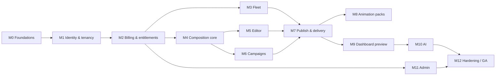

# Phase 6 — Implementation Plan

Build incrementally. **Do not** generate the full application in one pass. After each milestone: tests, lint/typecheck, security review of the delta, tenant-isolation tests where APIs exist, entitlement tests where billing exists, docs update.

## Milestone map

## M0 — Foundations

**Objective:** Repo, CI, AWS skeleton, observability, no product features yet.

| Area | Scope |
| --- | --- |
| Features | Monorepo, lint, typecheck, GitHub Actions, CDK app, `dev` account bootstrap, CloudWatch log groups |
| APIs | Health `/health` |
| Data | None (or empty Aurora) |
| UI | Placeholder apps that deploy to CloudFront |
| Tests | CI pipeline green |
| DoD | OIDC deploy to `dev`; secrets only in Secrets Manager; no credentials in git |

## M1 — Identity, organizations, RBAC

**Objective:** Users can sign up, create an org, invite, switch org.

| Area | Scope |
| --- | --- |
| Features | Cognito pools, login/logout, verify email, password reset, MFA for platform pool, memberships, permission catalog, session list |
| APIs | `/v1/me`, organizations, memberships, roles |
| Data | User, Organization, Membership, Role, Permission |
| UI | Login, onboarding shell, users page (basic) |
| Tests | Auth, invite, IDOR between two orgs |
| DoD | Cross-tenant read of org B’s members fails; audit on invite |

**Dependencies:** M0.

## M2 — Billing and entitlement enforcement

**Objective:** Access is a computed entitlement snapshot, not a banner.

| Area | Scope |
| --- | --- |
| Features | Plans, Stripe checkout/portal, webhooks, statuses, restricted mode, admin override table |
| APIs | `/v1/entitlements/me`, billing subscription/invoices/portal, webhook |
| Data | Plan, PlanEntitlement, Subscription, Invoice, PaymentAttempt, EntitlementOverride |
| UI | Account → Subscription; dashboard plan pill |
| Tests | Expired, past_due, grace, cancelled, failed payment, override |
| DoD | Mutating API without entitlement returns `403/402`; UI can still log in |

**Dependencies:** M1. Commercial confirmation of Stripe (ADR 013).

## M3 — Tickers and devices

**Objective:** Pair a player, heartbeat, online/offline.

| Area | Scope |
| --- | --- |
| Features | Claim code, device profile (matrix), groups, tags, replace, logs |
| APIs | tickers, devices, groups |
| Data | Ticker, Device, DeviceGroup; Dynamo heartbeat |
| UI | Tickers list/detail |
| Tests | Pairing over limit denied; heartbeat timeout → offline |
| DoD | Device never uses a user JWT; IoT policy scoped |

**Dependencies:** M2 (device count entitlement). Hardware spike can run in parallel.

## M4 — Composition core

**Objective:** JSON document + shared compositor (pixel snap) in `packages/composition`.

| Area | Scope |
| --- | --- |
| Features | Plugins: fill, text, image, lottie (subset), clock; schema validation; draft/version |
| APIs | contents, versions |
| Data | Content, ContentVersion, Asset (upload pipeline stub) |
| UI | Playback preview page (no full editor yet) |
| Tests | Validator, pixel-snap unit tests, version immutability |
| DoD | Same package runs in Node tests and browser player |

**Dependencies:** M1. Can start compositor in parallel with M2.

## M5 — Visual editor

**Objective:** Designers build layouts on the device profile.

| Area | Scope |
| --- | --- |
| Features | Canvas, layers, snap, typography, undo, save draft, preview |
| APIs | contents update, assets presign |
| Data | Asset ready pipeline |
| UI | Editor routes |
| Tests | Save draft does not change published version |
| DoD | Publish still gated (M7) but draft persist works |

**Dependencies:** M4.

## M6 — Campaigns and scheduling

**Objective:** Diwali-style windows with configurable priority.

| Area | Scope |
| --- | --- |
| Features | Campaigns, targets, recurrence, conflict resolution |
| APIs | campaigns, playlists |
| Data | Campaign, CampaignTarget, CampaignItem, Playlist |
| UI | Campaigns + scheduler |
| Tests | Priority seed vs custom; overlapping windows |
| DoD | Hierarchy is data; emergency is high priority + confirm |

**Dependencies:** M4, M2 (`scheduling.advanced` entitlement).

## M7 — Publish and delivery

**Objective:** Draft → snapshot → MQTT pointer → ack; offline cache.

| Area | Scope |
| --- | --- |
| Features | Publish job, compile, delivery status, retry, DLQ |
| APIs | publish, jobs, deliveries |
| Data | PublishingJob, ContentSnapshot, DeviceDelivery |
| UI | Publishing status on ticker detail |
| Tests | Unchanged version skip; offline play last snapshot; expired org cannot publish |
| DoD | Entitlement enforced in worker, not only API |

**Dependencies:** M3, M5 or M4 minimum, M2.

## M8 — Animation catalog

**Objective:** Packs added without app deploy.

| Area | Scope |
| --- | --- |
| Features | Packs, categories, entitlement keys, CDN |
| APIs | animation-packs |
| Data | AnimationPack, Animation |
| UI | Animations library |
| Tests | Pack without entitlement hidden and API-denied |
| DoD | Seasonal JSON from the reference pack can be imported as **catalog content**, not hardcoded |

**Dependencies:** M4, M2.

## M9 — Dashboard WYSIWYG

**Objective:** Home page shows current snapshot in player iframe.

| Area | Scope |
| --- | --- |
| Features | Overview metrics, alerts, preview |
| APIs | analytics overview (thin) |
| UI | Dashboard |
| Tests | Preview uses published snapshot only |
| DoD | Operator can answer “what is playing?” without opening editor |

**Dependencies:** M7.

## M10 — AI copilot and guide chatbot

**Objective:** Structured tools + help bot.

| Area | Scope |
| --- | --- |
| Features | Orchestrator, confirm high-impact, quotas, help RAG |
| APIs | ai conversations, tool confirm |
| Data | AIConversation, AIToolCall |
| UI | Prompt bar, chatbot dock |
| Tests | Unauthorized tool, invalid args, no cross-tenant in prompt |
| DoD | Tools call app services; audit `source=ai` |

**Dependencies:** M5, M6, M2 (`ai.copilot`).

## M11 — Admin portal

**Objective:** Staff operate tenants without sharing tenant passwords.

| Area | Scope |
| --- | --- |
| Features | Org search, suspend, plans, packs, flags |
| APIs | `/v1/admin/*` |
| UI | `apps/admin` |
| Tests | Platform JWT cannot hit tenant routes without context; tenant JWT cannot hit admin |
| DoD | MFA required; all overrides audited |

**Dependencies:** M2; catalog pieces from M8.

## M12 — Hardening and GA

**Objective:** Production bar.

- Load test publish + heartbeats
- cdk-nag, CodeQL, WAF rules
- Backup/restore drill
- Runbooks, on-call alarms
- Legal: retention, DPA, market-data contract
- Performance budget for compositor
- Accessibility pass on primary flows

**DoD:** Staging sign-off checklist in this file completed; prod deploy via approved workflow.

## After every meaningful milestone

1. Run tests  
2. Lint / typecheck  
3. Review architecture vs ADRs  
4. Security pass (authz, secrets, IDOR)  
5. Update docs if behavior changed  
6. Verify tenant isolation  
7. Verify subscription enforcement if the milestone touches access  
8. Verify deploy to `dev` (and staging when that env exists)

## Suggested first code after planning

When Phase 7 starts, the first PR should be **M0 only**: workspace tooling and empty apps, not the editor.

## Open questions (blockers vs later)

### Blockers before M2/M3 commercial

| ID | Question |
| --- | --- |
| Q1 | Confirm Stripe vs other PSP |
| Q2 | Trial length, grace days, activation-fee product |
| Q3 | Plan prices and entitlement numbers |
| Q4 | Device OS / player runtime and whether `PTPL1.0.2` can be replaced or bridged |
| Q5 | Market-data vendor |

### Later

| ID | Question |
| --- | --- |
| Q6 | SLAs (availability, publish latency) |
| Q7 | Data residency / multi-region year 1 |
| Q8 | White-label / reseller |
| Q9 | Emergency local override if cloud is down |
| Q10 | Audit/media retention period |
| Q11 | Festival pack ownership (platform vs tenant) |
| Q12 | Support impersonation legal approval |

Do not invent SLA numbers in code or contracts until Q6 is answered.
