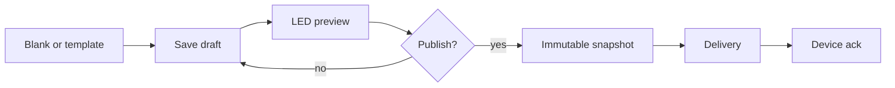

# Phase 5 — UX / Information Architecture

The portal must feel **powerful but not overwhelming**. Users should not need firmware knowledge to run a ticker. Guided creation, templates, AI, and a live LED preview carry the product.

Do **not** copy Photonplay Delta’s control-room chrome, MAC-as-name default, or three-silo Presets menu. Keep the *jobs*: see devices, see what is playing, edit content, pay the bill, get help.

## 1. Product surfaces

| Surface | Audience | Notes |
| --- | --- | --- |
| Marketing site | Prospects | Out of this repo initially |
| Tenant app (`apps/web`) | Org members | Primary product |
| Admin app (`apps/admin`) | Platform staff | Separate Cognito pool |
| Player (`apps/player`) | Hardware + preview iframe | Same compositor |
| Email | Billing, alerts | Transactional |

## 2. Tenant navigation (primary)

Global chrome: org switcher, search, AI guide, user menu, plan/status pill.

```
Home (Dashboard)
Tickers
  All tickers
  Ticker detail
  Groups
Content
  Library
  Editor (canvas)
  Assets
Templates
Animations
Campaigns
  Scheduler
Preview (full playback)
Analytics
Account
  Subscription & billing
  Users & roles
  Organization settings
Help (chatbot + docs)
```

Restricted subscription: chrome remains, but mutating routes redirect to **Account → Subscription** with a clear reason. Dashboard stays **read-only** (device health + last known preview).

## 3. Admin navigation

```
Organizations
Users (platform directory search)
Subscriptions / Plans / Entitlements
Tickers (cross-tenant, tenant-scoped queries)
Catalog (templates, animation packs)
Content moderation
System (flags, AI settings, logs)
Support tools
```

Platform admins pick an **organization context** before mutating tenant data.

## 4. Page inventory (tenant)

| Route (conceptual) | Purpose |
| --- | --- |
| `/login` `/forgot` `/verify` `/mfa` | Auth |
| `/onboarding` | Plan, org name, first device claim |
| `/` | Dashboard with **visual ticker preview** |
| `/tickers` `/tickers/:id` | Fleet, health, assigned playlist, logs |
| `/tickers/:id/preview` | Device-profile preview |
| `/content` `/content/:id/edit` | Library + canvas editor |
| `/templates` | Start from blank / platform / org |
| `/animations` | Packs by category |
| `/campaigns` `/campaigns/:id` | Windows, targets, priority |
| `/assets` | Media library |
| `/analytics` | Usage vs plan limits |
| `/account/subscription` | Plan, invoices, portal |
| `/account/users` | Invite, roles |
| `/account/settings` | Timezone, defaults |
| `/ai` | Conversation history (optional; copilot also docked) |

## 5. Dashboard

Must answer immediately: **what is on my ticker right now?**

Cards:

- Ticker count: total / online / offline
- Active content / scheduled / campaigns
- Subscription status + days to renewal
- Publishing job failures
- Storage and plan limits
- Recent activity
- **Preview strip** using `apps/player` at the device’s aspect ratio (not a generic black box)

Empty states: no devices (pair CTA), expired (billing CTA), offline (last snapshot + last heartbeat).

## 6. Visual editor

Ticker-native, not a website builder.

- Canvas sized to **device profile** (width × height px), zoom, grid, snap
- Layers, z-index, align, typography, color, opacity, shadows (quantized in preview)
- Scroll regions vs static regions
- Timing: duration, delay, easing, loop
- Asset library + template insert
- Undo/redo, copy/paste, shortcuts
- Right inspector: component properties + bindings
- Bottom: timeline / sequence
- Actions: Save draft, Preview playback, Publish (permission + entitlement)
- Version history drawer
- AI prompt bar: “make headline larger” → plan + preview diff

Editor never talks to the database. It saves compositions through `/v1/contents`.

## 7. Content workflow



Live tickers change **only** on publish (or scheduled campaign activation), never on every keystroke.

## 8. Device workflow

1. Generate claim code (entitlement `devices.max`)
2. Device shows code / operator types it
3. Name, location, confirm matrix from handshake
4. Assign default playlist
5. Heartbeat appears on dashboard
6. Replace: new device inherits ticker logical identity

Emergency: Operator posts campaign with high priority + short TTL; confirmation modal; audit.

## 9. Subscription workflow

- Trial clock on dashboard
- Upgrade/downgrade with proration explanation
- Stripe Customer Portal for cards and invoices
- Past due: banner + restricted mutating APIs
- Expired: billing-only mutations
- Cancel: access until period end copy, then restricted

Never rely on hiding the Publish button alone.

## 10. AI assistant workflow

**Copilot** (creator): prompt on editor/campaign → structured plan cards → optional confirm → apply.

**Guide** (chatbot): “Where can I create a ticker?” → “Go to Tickers → Add ticker” + navigate if allowed.

Context injected: route, role, entitlements, feature flags. If the user cannot publish, the bot must not offer publish as a shortcut.

## 11. Admin workflow

Search org → view subscription → override entitlement (reason, expiry) → audit. Suspend org → new publishes stop; support message on tenant dashboard.

## 12. UX principles

- **Preview before publish**
- **Named tickers**, not MAC addresses as the primary label (hardware ID still visible)
- **Guided first run** (replace “Guide Tour” with contextual checklists)
- **Search** across tickers, content, campaigns
- **Command palette** later; AI prompt is the first command surface
- WCAG 2.2 AA intent on portal controls; LED preview is a canvas, provide text fallback of current message
